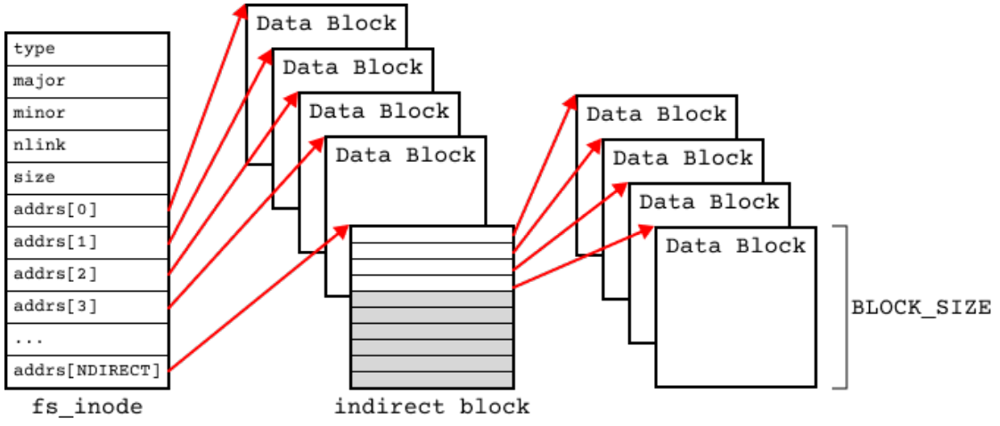

# COSC204 Assignment 2 - File System with Indexed Allocation
## Table of Contents
- [*Objective*](#objective)
- [*Structure of the Index Node*](#structure-of-the-index-node)
- [*What to Do*](#what-to-do)
- [*Development Log*](#development-log)
### Objective:
Create two programs, one which is able to store a file using indexed allocation (as from [Lecture 15](https://blackboard.otago.ac.nz/bbcswebdav/pid-3172094-dt-content-rid-20854941_1/courses/COSC204_S2DNI_2023/l15.pdf)) and the other to retrieve a file. The programs will both use the ```/dev/memdrv``` block devide from [Lab 18](https://blackboard.otago.ac.nz/bbcswebdav/pid-3213642-dt-content-rid-20939814_1/courses/COSC204_S2DNI_2023/lab18.pdf). It wll also use ```libmemdrv.c``` and ```libmemdrv.h``` to interface with the ramdisk.
### Structure of the Index Node
```c
#define NDIRECT 122
// On-disk inode structure
typedef struct fs_inode{
    short type;                 // File type
    short major;                // Major device number
    short minor;                // Minor device number
    short nlink;                // Number of links to inode in file system
    int size;                   // Size of file (bytes)
    int8_t addrs[NDIRECT +1];   //Data block addresses
} Inode;
```
The inode (```fs_inode``` above) should be stored in block 0 of the ramdisk. The ```inode``` provides 12 direct indexes (```NDIRECT```) and 1 indirect index (no double indirect or triple indirect indexes). Each index is simply the block number where file data is stored. Small files will only need the direct addresses, larger files may need the indirect index.

### What To Do:
#### 1. Development Log*
> Maintain a development log in a file called ```README.md``` at the top level of your git repo. Thiis file should read from top to bottom in chronological order, describing any ideas and implementaton details as you progress through the assignment.
#### 2. Modifications to ```Makefile``` and ```libmemdrv.h```
> Content from [Lab 18](https://blackboard.otago.ac.nz/bbcswebdav/pid-3213642-dt-content-rid-20939814_1/courses/COSC204_S2DNI_2023/lab18.pdf) can be used as a basis for ths assignment with a few minor modifications
>> In ```libmemdrv.h``` update ```BLOCK_SIZE``` and ```MAX_BID``` to 64 and 78
>>> ```c
>>> #define BLOCK_SIZE 64
>>> #define MAX_BID 78
>>> ```
> Reducing the block size to 64 bytes makes it much easier to see what's going when debugging. It also reduces the maximum file size to 4864 bytes (64 x 78 = 4992 bytes minus 2 blocks; one for the inode and one for the indirect index.)
> In your ```Makefile```, add rules to create ```store-prog``` and ```retrieve-prog``` from your ```store.c``` and ```retrieve.c``` source files. Make sure you include the flags ```-g -W -Wall``` during compilation.
#### 3. The Storing Program
> - This program should take a command-line argument, which is the name of a file that you want to store in ```/dev/memdrv```.
> - If the length of the file is greater than 4864 bytes it should be truncated and the word truncated printed to ```/stderr/```.
> - The program should take an optional second command-line argument ```-r``` which specifies a random ordering of the blocks in the direct and indirect indexes.
#### 4. The Retrieving Program
> - The retrieving program should take no more than one command-line argument. If there is no argument, print the file to standard output. If there is an argument e.g. ``````./retrieve-prog newfile```, the retrieved file should be saved to a file with the name newfile. If the file already exists ask the user for confirmation before overwriting.
> - The program should not assume any sequence of the stored data blocks. They could be stored anywhere randomly on the RAMDISK.
> - The retrieved file should be exactly the same as the stored file. You can use the command e.g. ``````./store-prog myfile.txt``` to store any file to the device according to the indexed allocation. Then you can compare the stored file and retrieved file with diff.
>> ```c
>> ./store-prog myfile.txt
>> ./store-prog myfile_copy.txt
>> ./store-prog myfile_copy.txt
>> ```
### Development Log
